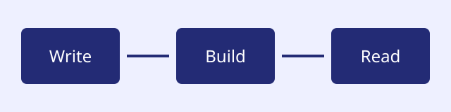

Welcome to **Starlyt Docs**, a documentation site built from ordinary Markdown. Read the [long guide](./guides/long-guide/) or explore the [code examples](./reference/code-examples/).

## Getting started

Choose a topic in the sidebar. This overview uses *emphasis*, **strong text**, and literal inline code such as `<article>`.

- Install the theme.
- Configure ordered navigation.
- Write Markdown and publish your site.

## Documentation workflow

1. Make a small, reviewable change.
2. Build the site locally.
3. Check the rendered result before publishing.

> Good documentation explains what a reader can do, not just how the software is arranged.

### Using `config.json`

Configuration is ordinary data. Keep the content separate from the theme.

## A small diagram

